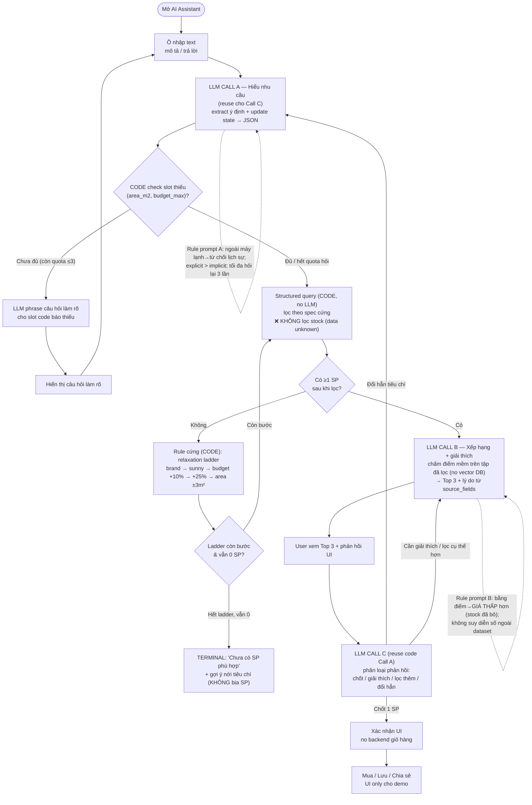
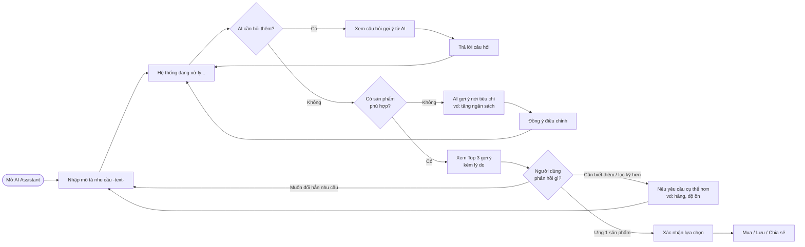

# Flows (đã điều chỉnh) — Điện Máy Xanh AI Advisor

Điều chỉnh vs bản gốc: **bỏ stock** (data không có), **code quyết slot thiếu** (LLM chỉ diễn đạt câu hỏi),
**tie-break → giá thấp**, **ladder +10%/+25%** thay "+20%", **terminal khi 0 SP**, **scope = máy lạnh**,
annotate **latency 2 LLM call** trên path Top-3.

---

## 1. AI Flow (kỹ thuật)

> **Latency:** path `đủ thông tin → Top 3` = **Call A + Call B** (2 LLM call tuần tự) → tổng phải < 5s (SLA).
> Ranking code ~3ms. Preload catalog lúc startup.

---

## 2. User Flow (trải nghiệm)

---

### Ghi chú khớp guardrails (`antigravity/.agents/guard_agent.yaml`)
- `no_stock_claims` → nhánh stock đã xóa khỏi cả 2 flow.
- `clarification_budget` (max 3) → điều kiện quota trên nhánh "Chưa đủ".
- `scope_guard` → refuse ngoài máy lạnh (Rule prompt A).
- `code_rules.no_results_terminal` → box TERMINAL trong AI flow.
- `grounded_explanation` → "lý do từ source_fields" ở Call B.
